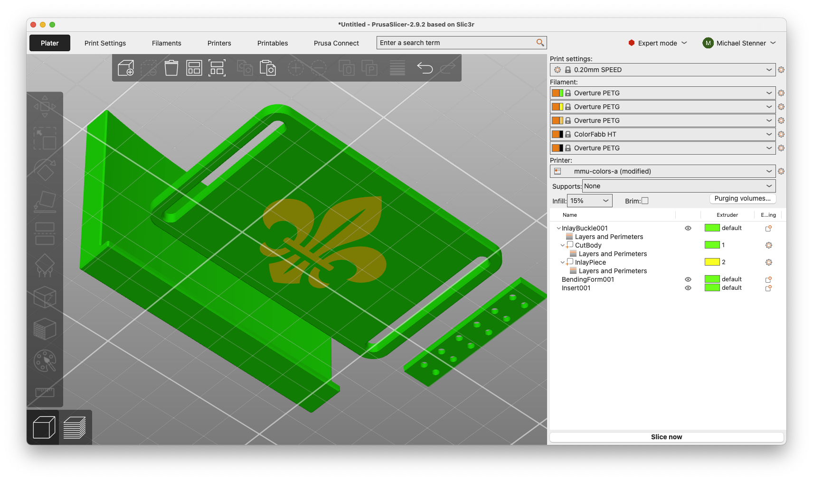
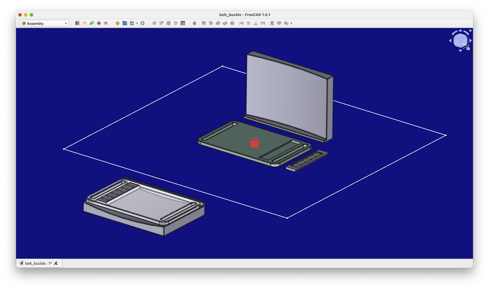
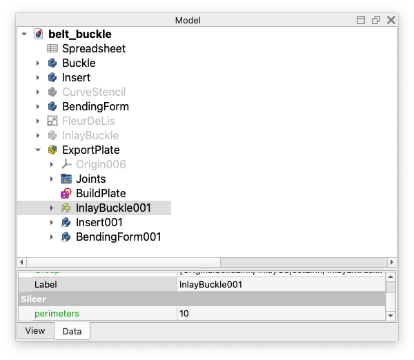

# PrintFlow
**Stop fiddling with the slicer, stay focused on design.**

*From FreeCAD to Slicing in One Click*

* **One-click export** from FreeCAD to your slicer
* **Smart object detection** - exports what you actually want to print
* **Build Plate Layout** - use FreeCAD Assemblies to place your parts
* **Embedded Print Settings** - no more reconfiguring every iteration
* **Multi-Material** - set extruder and other settings per-object
* **Designed Support** - multi-shape objects make designed supports easy

---

# PrintFlow Manual

## Table of Contents

### Getting Started
1. **Installation**
2. **Quick Start**
3. **Basic Concepts**

---

## Getting Started

### 1. Installation

**Requirements:**
- FreeCAD 1.0 or later
- Slicer (you don't *need* it, but then you probably don't need this
  macro)

**Installation Steps:**
1. Download `PrintFlow.FCMacro` from the FreeCAD macro repository
2. Copy to your FreeCAD macro directory:
   - **Windows**: `%APPDATA%\FreeCAD\Macro\`
   - **macOS**: `~/Library/Application Support/FreeCAD/Macro/`
   - **Linux**: `~/.local/share/FreeCAD/Macro/`
3. Access via `Macro > Execute macro > PrintFlow.FCMacro`

**First Run Setup:**
On first use, PrintFlow will prompt you to configure your slicer:
- **Slicer Format**: Supports PrusaSlicer and Cura
- **Slicer Path**: Browse to your slicer executable (e.g., PrusaSlicer.exe)
- **Default Behavior**: Choose whether to auto-launch slicer and append version numbers
- All settings are saved automatically in FreeCAD Parameters
- To change later: Edit > Preferences > General > Parameter Editor >
  BaseApp/Preferences/Macros/PrintFlow

### 2. Quick Start

PrintFlow makes 3D printing faster by letting you keep slicer settings
in FreeCAD: part orientation, bed layout, designed supports, and print
settings. You spend less time fiddling in the slicer and stay focused
on design.

Here are the three main ways to use PrintFlow:

#### Method 1: Select and Go!
Perfect for rapid prototyping and iteration:

1. **Select objects** that you want to print in the FreeCAD Tree View
2. **Run PrintFlow macro** (`Macro > Execute macro > PrintFlow.FCMacro`)
3. **Done!** Your slicer opens with parts positioned exactly as they were in FreeCAD

Selection overrides everything else. Even if you implement the
methods described below, you can always just select what you want to
print.  This is perfect for quick test prints for just one or two parts.

#### Method 2: Put "Export" in the FreeCAD Label
For objects you print regularly without constant selection:

1. **Add "Export" anywhere in object labels**: "MyExportWheel", "Export_Bracket", "Print_Bed_1_Export"
2. **Run PrintFlow** (no selection needed)
3. **All "Export" objects** automatically export

Great for marking final parts while keeping work-in-progress objects
out of your exports.  When used for a Group or Assembly, this will
apply to its contents.

#### Method 3: Property Control
For complex projects needing fine-grained control:

1. **Right-click object** → Properties → Add Property
2. **Add "Export" property** (Boolean) in "Export" group
3. **Set Export = True** to include, **Export = False** to exclude
4. **Run PrintFlow**

This method gives you precise control over what exports, especially useful for large projects.

### 3. Basic Concepts

**Why PrintFlow?**
3D printing is often called "rapid prototyping", and PrintFlow is designed to make it faster by reducing iteration time. Set your slicer settings *once* in FreeCAD so you don't need to reconfigure them every time you tweak the model.

**Export Priority (What Gets Exported):**
- **Selection active?** → Export only selected objects (ignores all properties)
- **No selection?** → Export objects with Export=True or "Export" in label

**Organization Structures:**
PrintFlow intelligently uses FreeCAD's organizational structures:
- **Assemblies**: Contents become separate slicer objects (great for print layout and part orientation)
- **Parts (StdPart)**: Become slicer objects with multi-part support (useful for multiple extruders or designed supports)
- **Groups**: FreeCAD organization only (no impact on output structure)

**Property System:**
- **Export properties**: Control what gets exported
- **Slicer properties**: Control print settings (infill, perimeters, layer height, etc.)
- **Inheritance**: Settings flow down the tree from parent to child
- **Override**: Child properties (if defined) override parent settings

This keeps configuration simple while allowing fine control when needed.

**Configuration Levels:**
PrintFlow uses a three-level configuration system for maximum flexibility:

1. **FreeCAD Parameters**: Global preferences stored in FreeCAD's parameter system
2. **Document Properties**: Properties added to specific FreeCAD documents
3. **Object Properties**: Properties added to individual objects for fine-grained control

**Property Groups:**
PrintFlow uses three property groups with specific purposes:
- **"PrintFlow" group**: Macro behavior settings (document-level only, don't inherit)
- **"Export" group**: Export control properties (inherit from parent to child objects)
- **"Slicer" group**: Print settings like layer height, infill (inherit from parent to child objects)

This design ensures slicer settings flow down from assemblies to parts while keeping macro behavior settings at the appropriate level.

PrintFlow *does not* modify your objects or designs.  It will set some
FreeCAD parameters (like your slicer path) and track export version
number at the document level if you request it.

### FreeCAD Parameters (Global Preferences)
PrintFlow stores global preferences in FreeCAD's parameter system at:
`User parameter:BaseApp/Preferences/Macros/PrintFlow`

| Parameter | Type | Description |
|-----------|------|-------------|
| `SlicerPath` | String | Path to slicer executable |
| `SlicerFormat` | String | 3MF output format (e.g., "PrusaSlicer") |
| `RunSlicer` | Boolean | Auto-launch slicer after export |
| `AppendVersion` | Boolean | Add version number to filename |

**First-run setup**: PrintFlow will prompt you to configure these settings and save them automatically.

**To change later**: Edit > Preferences > General > Parameter Editor > BaseApp/Preferences/Macros/PrintFlow

### Document Properties (Per-Project Control)
Each of the FreeCAD Parameter settings can be overridden at the document level by adding properties in the "PrintFlow" group:
- `RunSlicer`, `AppendVersion`, `SlicerPath`, `SlicerFormat`

Additional advanced document properties are available - see [Advanced Configuration](#advanced-configuration).

**To add**: Right-click document in Tree View → Properties → Add Property

### Object Properties (Fine-Grained Control)
Add these properties to individual objects for precise control:

**Export Control:**
- **`ExportPath` (String, "Export" group)**: Makes objects eligible
  for export and sets their structure in the slicer. Setting this to a
  dot-separated string like "Car.FRWheel" makes the object
  exportable with that hierarchy, regardless of its actual FreeCAD
  tree position.

- **`Export` (Boolean, "Export" group)**: Controls whether eligible
  objects are included in the export. Setting Export=True won't force
  ineligible objects to export - they must first be made eligible with
  ExportPath.

**How it works:** PrintFlow has two requirements for export:
**eligibility** and **inclusion**.  Eligibility is set by default
using pretty sane rules about type (Bodies, Parts, etc.) and structure
(steps *within* a PartDesign object are not eligbile by default), but
you can make any object (that has a 3D Shape) eligible by setting
ExportPath. Then Export=True/False controls *which* eligible objects
are actually included. Think of ExportPath as "can this export?" and
Export as "should this export?"

For slicer settings (layer height, infill, etc.), see [PrusaSlicer Properties Reference](#prusaslicer-properties-reference).

For advanced export properties, see [Advanced Configuration](#advanced-configuration).

**To add**: Right-click object → Properties → Add Property → Select appropriate group

---

## Advanced Configuration

### Advanced Document Properties
For power users who need fine control over export behavior (all use "PrintFlow" group):

- **`PrintFlowDebug` (Integer)**: Control logging verbosity (0-4):
  - 0: No logging output
  - 1: Critical errors only (with popup dialogs)
  - 2: Errors and warnings (default)
  - 3: Add progress info (export lists, object counts, slicer choices)
  - 4: Full debug output (internal state, detailed processing)
  Messages appear in FreeCAD's Report View and are saved to PrintFlow.log.

- **`LinkTreePriority` (Boolean, default: True)**: Links can inherit
  properties (slicer settings, etc.) from both their Linked Object and
  their parent container.  By default, the "Tree" inheritance has
  priority, but this can be overridden at the document level.  These
  properties can also be explicitly set on the Link itself.

- **`ExportDelimiter` (String, default: ".")**: Character used to
  separate levels in export paths. For example, "Car.FRWheel" uses "."
  as the delimiter. Change this if you need different path separators.

- **`AutoExportPattern` (String, default: ".*Export.*")**: Regular
  expression that determines which objects are automatically marked
  for export based on their labels. The default pattern matches any
  label containing "Export".  Under the hood, this just sets
  "Export=True" on the matching objects.

- **`ExportPattern` (String, default: "{BasePath}")**: Template for
  generating 3MF filenames. Available variables:
  - `{BasePath}`: Document filename without extension
  - `{DirName}`: Document directory
  - `{ExportVersion}`: Version number (when AppendVersion=True)

  Example: "{DirName}/exports/{BasePath}-v{ExportVersion}" creates
  organized export paths.

- **`ExportVersion` (Integer)**: Auto-incremented version number used
  when AppendVersion=True. PrintFlow manages this automatically - you
  shouldn't need to set it manually.

- **`IgnoreAssemblyPlacement` (Boolean, default: True)**: Controls
  whether Assembly objects' absolute positions are ignored during
  export. When True (default), parts within Assemblies export at their
  Link positions, ignoring the Assembly's own placement. Set to False
  if you want the Assembly's absolute position to affect part
  placement in the slicer.  Assemblies are handy for laying out an
  entire build plate, and this lets you have multiple such build
  plates in your FreeCAD model.

### Advanced Object Properties
As described above, PrintFlow determines if an object *can* be
exported and *whether* to export it using the *ExportPath* and
*Export* properties.  When determining *default* eligibility,
PrintFlow effectively derives the value of *ExportPath* internally
using several control properties, your model structure, and the
objects' types.  We will explain the logic and introduce the variables
working backward from *ExportPath*.

- **`ExportPath` (String)**: As described above, this is a
  delimiter-separated string (default delimiter: "."), that will
  influence *how* an object is exported, whether as a container, or a
  shape within a container.  For example, a Part might have
  *ExportPath="Car"* and then there might be four Cylinders with
  *ExportPath="Car.FRWheel"*, etc.  In the slicer, these will show up
  as nested objects that can be placed together.

- **`ExportName` (String)**: By default, segments in *ExportPath* are
  simply the values of *ExportName* for each of the FreeCAD objects
  themselves.  If not specified, *ExportName* will just be set to the
  FreeCAD object's Label.  This is particularly handy when you want to
  re-use a name and get tired of all those "001"s!

- **`ExportContainer` (Boolean)**: When generating *ExportPath* from
  the object tree, the "top" (first) element will often be a
  container, like a Part object, with shapes inside.  This property
  forces an object to export as a container (organizes children)
  rather than a shape. PrintFlow normally determines this
  automatically based on object type - only override if you need
  special behavior.

- **`ExportShape` (Boolean)**: At the other end of the *ExportPath#
  string is the "Shape" object.  This forces an object to export its
  3D shape rather than acting as a container. PrintFlow normally
  determines this automatically - only override for special cases like
  making a Part export as a single shape instead of organizing its
  contents.

- **`IgnoreAssemblyPlacement` (Boolean, default: True)**: This is
  exactly the same as the document-level property, but it can be used
  to set the behavior of individual Assemblies.

- **`SlicerFormat` (String)**: Override the 3MF output format for this
  specific object. Useful when you want different parts of your
  project to use different slicers. For example, you could have
  multiple links that let you export to different slicers.  Currently
  supports "PrusaSlicer" only.

---

## Examples and Recipes

### Recipe 1: Multi-Material Print
Perfect for printing objects with different materials or colors:

**Scenario**: A custom belt buckle with inlay (Be Prepared!)

**Setup**:
1. Create the buckle and inlayed logo
2. Add slicer properties:
   - **Buckle**: Add `extruder = 1` (green filament)
   - **Inlay**: Add `extruder = 2` (yellow filament)
3. Run PrintFlow → Both parts automatically assigned to correct extruders

**Result**: PrusaSlicer opens with parts assigned to correct extruders.

### Recipe 2: Build Plate Layout
Arrange your build plate one time in FreeCAD.

**Scenario**: Place and orient your parts for best printing.

**Setup**:
1. Design your parts
2. Create Assembly named "ExportPlate"
3. Add links to your parts and arrange them
4. Run PrintFlow → Perfect build plate layout

**Result**: Parts are oriented for fit, strength, support, smoothness,
or whatever you need.

### Recipe 3: Apply Print Settings to Objects as Needed

**Scenario**: Set exttruder, perimeters, etc.

**Setup**:
1. Add slicer properties to objects
4. Run PrintFlow

**Result**: settings appear in the slicer.

### Recipe 4: Override Auto-Detection
Force specific export behavior when PrintFlow's defaults don't match your needs:

**Scenario**: Export a PartDesign Pad (normally ignored) as a standalone shape.

**Setup**:
1. Right-click the Pad object → Properties → Add Property
2. Add `ExportPath = "MyCustomPart"` (String, "Export" group)
3. Add `Export = True` (Boolean, "Export" group)
4. Run PrintFlow

**Result**: The normally-ignored Pad exports as "MyCustomPart" in the slicer.

### Finding New Slicer Properties
Want to use a slicer setting that's not documented? Here's how to discover the exact property name:

**Steps**:
1. Open your slicer (PrusaSlicer, etc.)
2. Set the property you want (e.g., change infill pattern to "hilbert")
3. Save as 3MF file
4. Unzip the 3MF file (it's just a ZIP archive)
5. Look in `Metadata/Slic3r_PE_model.config` for the exact property name
6. Use that name in FreeCAD (e.g., `fill_pattern = "hilbert"`)

**Example**: If you find `<metadata type="volume" key="top_fill_pattern" value="monotonic"/>` in the file, use `top_fill_pattern = "monotonic"` as your FreeCAD property.

---

## PrusaSlicer Properties Reference

Common slicer properties you can add to objects (use "Slicer" group).
Note that PrintFlow doesn't actually know or care what any of these
are; it just passes them through to the slicer.  If the slicer
supports it, PrintFlow does, too!

### Print Quality
| Property | Type | Description | Example Values |
|----------|------|-------------|----------------|
| `layer_height` | Float | Layer thickness | 0.15, 0.2, 0.3 |
| `first_layer_height` | Float | First layer thickness | 0.2, 0.3 |
| `perimeters` | Integer | Wall count | 2, 3, 4 |
| `top_solid_layers` | Integer | Top layers | 3, 4, 5 |
| `bottom_solid_layers` | Integer | Bottom layers | 3, 4, 5 |

### Infill and Support
| Property | Type | Description | Example Values |
|----------|------|-------------|----------------|
| `fill_density` | String | Infill percentage | "15%", "20%", "100%" |
| `fill_pattern` | String | Infill pattern | "grid", "honeycomb", "triangular" |
| `support_material` | Integer | Enable supports | 0 (off), 1 (on) |
| `support_material_threshold` | Integer | Support angle | 45, 60 |
| `support_material_pattern` | String | Support pattern | "rectilinear", "honeycomb" |

### Speed and Temperature
| Property | Type | Description | Example Values |
|----------|------|-------------|----------------|
| `perimeter_speed` | Integer | Wall print speed | 30, 45, 60 |
| `infill_speed` | Integer | Infill print speed | 60, 80, 100 |
| `first_layer_temperature` | Integer | Hotend temp (first layer) | 215, 220 |
| `temperature` | Integer | Hotend temp (other layers) | 210, 215 |
| `first_layer_bed_temperature` | Integer | Bed temp (first layer) | 60, 70 |
| `bed_temperature` | Integer | Bed temp (other layers) | 55, 65 |

### Multi-Material
| Property | Type | Description | Example Values |
|----------|------|-------------|----------------|
| `extruder` | Integer | Extruder assignment | 1, 2, 3, 4 |

---

## Cura Export Notes

PrintFlow supports exporting 3MF files compatible with Cura, but there are some important differences from PrusaSlicer exports:

### Cura-Specific Behaviors

**Automatic Object Placement:**
- Cura automatically repositions objects on the build plate when opening 3MF files
- Objects may appear rotated or translated from their FreeCAD positions for optimal printing layout
- Use `Edit > Undo` immediately after opening to restore original positions if needed

**Extruder Assignment:**
- Currently no automated way to preserve extruder assignments in Cura
- Multi-material prints require manual extruder selection in Cura after import
- This is a limitation of Cura's project file format requirements

### Technical Details

PrintFlow generates standard 3MF files for Cura (not project files) because:
- Cura project files require complete printer-specific configurations
- No universal solution exists for preserving all settings across different printer setups
- Standard 3MF files maintain geometry and can be imported into any Cura installation

---

## Cura Properties Reference

**Verified by Source Code Analysis**: These properties are confirmed to work based on Cura's 3MF reader code.
Add these to objects using the "Slicer" group. PrintFlow passes them through with the `cura:` namespace prefix.

### Special Handling Properties
These receive custom processing in Cura's 3MF reader:

| Property | Type | Description | Example Values |
|----------|------|-------------|----------------|
| `extruder_nr` | Integer | Extruder assignment (0-based) | 0, 1, 2, 3 |
| `print_order` | Integer | Print sequence | 1, 2, 3 |
| `drop_to_buildplate` | Boolean | Drop object to build plate | true, false |

### Standard Cura Settings
These are passed to Cura's setting system if recognized:

| Property | Type | Description | Example Values |
|----------|------|-------------|----------------|
| `wall_line_count` | Integer | Wall/perimeter count | 2, 3, 4 |
| `infill_sparse_density` | Integer | Infill percentage | 15, 20, 100 |
| `infill_pattern` | String | Infill pattern | "zigzag", "grid", "lines", "triangles" |
| `speed_print` | Float | Print speed in mm/s | 50.0, 80.0, 120.0 |

### Other Properties
Any valid Cura setting name should work. If Cura doesn't recognize a property, it's stored in metadata but ignored.

**Note**: Cura uses 0-based extruder numbering (0, 1, 2...) while PrusaSlicer uses 1-based (1, 2, 3...).

---

*This manual covers PrintFlow version 1.2.0*
